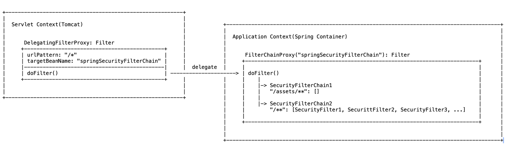

## 02. Filter Chain(Proxy) [filter-chain]

#### Filter Chain

#### SecurityFilterChain
1. Spring Security에서 지원하는 Filter Chain 인터페이스
2. 특정 요청(URL 패턴)에 대해 순서대로 연결(chain)된 보안 필터들을 적용할 수 있다.

#### DefaultSecurityFilterChain
1. Spring Security에서 지원하는 SecurityFilterChain의 구현 클래스
2. SecurityFilterChain을 직접 구현하는 것 보다 비교적 쉽게 URL 패턴과 필터 체인을 설정할 수 있다.

#### FilterChainProxy
1. DelegatingFilterProxy로 부터 보안 처리를 위임받은 Spring Security의 Filter Bean
2. 특정 요청(URL 또는 URL패턴)에 매핑된 SecurityFilterChain 들의 List로 구성
3. 앞의 DeletegatingFilterProxy로 부터의 모든 요청을 받은 후, 특정 요청과 매핑된 SecurityFilterChain를 작동시키는 보안 FilterChain에 대한 Proxy 역할
4. Spring Security 설정은 FilterChainProxy Bean과 내부의 SecurityFilterChain(DefaultSecurityFilterChain)에 대한 설정을 의미한다.

#### 예제01: FilterChainProxy Bean 설정: 인터페이스 SecurityFilterChain 직접 구현
1. Filter Chain 0: "/01/**"     -> [SecurityFilterEx01, SecurityFilterEx02]
2. Filter Chain 1: "/02/**"     -> [SecurityFilterEx03, SecurityFilterEx04]
3. 설정: config.web.SecurityConfigEx01
4. 테스트: config.web.SecurityConfigEx01Test

#### 예제02: FilterChainProxy Bean 설정: DefaultSecurityFilterChain 사용
1. Filter Chain 0: "/01/**"     -> [SecurityFilterEx01, SecurityFilterEx02]
2. Filter Chain 1: "/02/**"     -> [SecurityFilterEx03, SecurityFilterEx04]
3. 설정: config.web.SecurityConfigEx01
4. 테스트: config.web.SecurityConfigEx02Test

#### 예제03: FilterChainProxy Bean 설정3: DefaultSecurityFilterChain & Spring Security Filter 사용
1. Filter Chain 0: "/assets/**" -> []
2. Filter Chain 1: "/**"        -> [DisableEncodeUrlFilter, WebAsyncManagerIntegrationFilter, DefaultLoginPageGeneratingFilter]
3. 설정: config.web.SecurityConfigEx03
4. 테스트: config.web.SecurityConfigEx03Test

#### Summary: Spring Security Architecture
